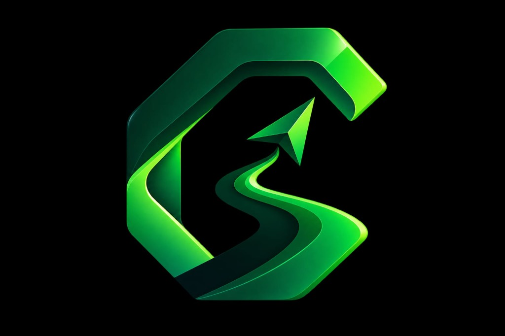

# CareerOS (FutureForge) 🚀

<div align="center">
  
  <br/>
  <strong>One intelligent platform to learn, practice, prepare and move closer to your first opportunity.</strong>
</div>

<br/>

## 🌟 Overview

**CareerOS** is a comprehensive Student Career System designed to guide candidates from confusion to direction. It provides a complete, gamified environment to sharpen your skills, build your profile, and secure your first tech opportunity.

By combining structured learning paths, intelligent assessments, and interactive code execution, CareerOS ensures you are genuinely industry-ready.

## 🎯 Core Modules

- **01 | APTITUDE:** Sharpen logical thinking, quantitative ability, and problem-solving through the interactive Aptitude Arena.
- **02 | CODING:** Practice programming, Data Structures & Algorithms, and real placement problems in our integrated IDE (The Crucible).
- **03 | INTERVIEW:** Prepare for technical, HR, and communication rounds using our AI-driven Mock Interview and 60-second Spoken Technical Defense.
- **04 | GUIDANCE:** Get personalized, dynamic roadmaps based on your specific career goals and real-time progress.

## ✨ Key Features

- **The Crucible Workflow:** A rigorous, 3-phase technical assessment engine:
  - **Phase A (Logic):** Explain the algorithmic approach and complexity (e.g., Sliding Window, Two Pointers).
  - **Phase B (Coding):** Write optimized production code in Python, C++, or TypeScript with real-time execution.
  - **Phase C (Defense):** Defend your code choices in a simulated 60-second audio defense.
- **Trailhead Dashboard:** Your personal expedition roadmap, tracking your progress across all skills.
- **Skill Graph:** A visual, topographic representation of your technical capabilities and growth.
- **Resume Studio & Jobs Portal:** Build a standout resume and track your applications effortlessly.

## 🛠️ Technology Stack

- **Frontend:** React, TypeScript, Vite, Tailwind CSS (Custom Styling)
- **Backend:** Node.js, Express, TypeScript
- **Database:** Supabase (PostgreSQL) with in-memory local fallbacks
- **Code Execution:** Piston API (Isolated code compilation & execution)
- **AI Integration:** Google Gemini API for intelligent grading and feedback

## 🚀 Getting Started

### Prerequisites
- [Node.js](https://nodejs.org/en/) (v18 or higher)
- A Supabase account (optional, for persistent data)
- A Gemini API Key

### Installation

1. **Clone the repository:**
   ```bash
   git clone https://github.com/njr-vetri/FutureForge.git
   cd FutureForge
   ```

2. **Install frontend and backend dependencies:**
   ```bash
   npm install
   cd backend
   npm install
   cd ..
   ```

3. **Set up Environment Variables:**
   - Create a `.env` file in the root directory and add your keys:
   ```env
   GEMINI_API_KEY=your_gemini_api_key_here
   VITE_SUPABASE_URL=your_supabase_url_here
   VITE_SUPABASE_ANON_KEY=your_supabase_anon_key_here
   ```
   - (For full backend execution, create `backend/.env` with your Supabase Service Role Key).

4. **Run the Application:**
   
   *Start the Backend API:*
   ```bash
   npm run dev:api
   ```
   
   *Start the Frontend:*
   ```bash
   npm run dev
   ```

5. **Open your browser:** Navigate to `http://localhost:3000` to enter the system.

## 📄 License

© 2026 CareerOS / VIT Chennai. All Rights Reserved.
